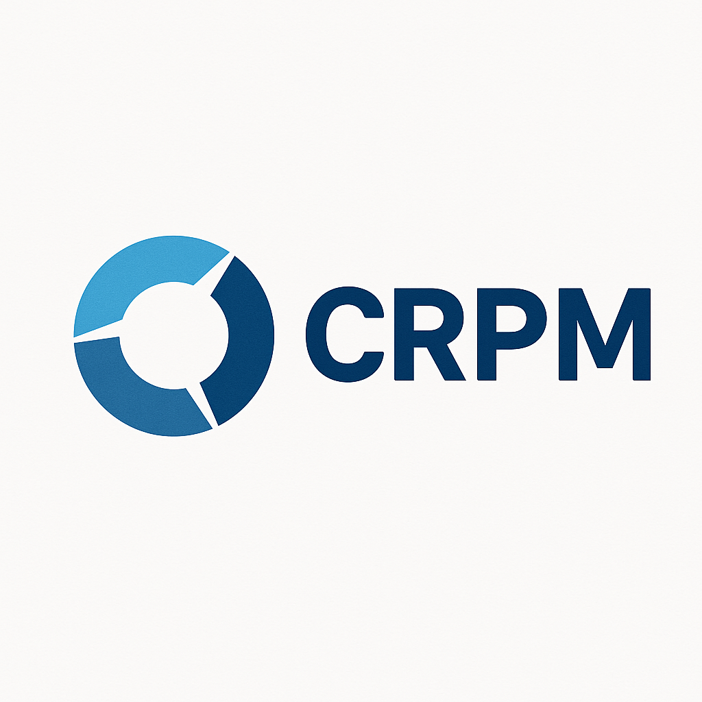

# CPRM - Centralized Patient & Resource Management System

<div style="display: flex; align-items: center; gap: 16px; border: 1px solid #ccc; padding: 12px; border-radius: 8px; width: fit-content;">
  
  <div style="display: flex; flex-direction: column;">
    <a href="https://cprm-prototype.vercel.app" target="_blank" style="font-weight: bold; font-size: 16px; text-decoration: none; color: #007acc;">
      🌐 cprm-prototype.vercel.app
    </a>
  </div>
</div>

## Smart Display System for Wenlock Hospital

## 🏥 **Project Overview**

CPRM is a **Smart Display Management System** designed specifically for **Wenlock Hospital's 73 display screens** across Cardiology, OT, and Pharmacy departments. This prototype addresses the critical need for unified real-time communication, emergency alert broadcasting, and synchronized department operations.

### **🎯 Core Problem Solved**
- **73 Fragmented Displays** → **Unified Display Network**
- **Department Silos** → **Real-time Synchronization** 
- **Emergency Communication Gaps** → **Instant Alert Broadcasting**
- **Patient Privacy Risks** → **Token-Based Security System**

## 🚀 **Key Features**

### **📺 Smart Display Management**
#### **Public Patient Displays**
- **Token-Based Queues**: Privacy-safe patient identification (P001, P002, etc.)
- **Real-time Wait Times**: Live queue progression and estimates
- **Department Status**: "OT-1 Ready", "Cardiology Queue: 3 patients"
- **Emergency Overlays**: Code Blue/Red alerts override normal content

#### **Staff Internal Displays**
- **Detailed OT Schedules**: Complete surgery timetables with surgeon assignments
- **Drug Inventory Alerts**: "Morphine: Low Stock - 12 units remaining"
- **Patient Flow Tracking**: Real-time bed availability and patient movement
- **Emergency Protocols**: Detailed Code Blue/Red response procedures

### **🔄 Real-Time Department Synchronization**
#### **OT ↔ Pharmacy Integration**
```
Surgery Scheduled → Pharmacy Alert → Medication Preparation
Emergency Surgery → Priority Drug Allocation → Stock Reservation
Post-Surgery → Medication Reconciliation → Inventory Update
```

#### **Cardiology ↔ OT Coordination**
- Pre-surgery cardiac assessments sync with OT scheduling
- Post-surgery monitoring alerts to cardiology teams
- Shared patient status updates across departments

### **🚨 Emergency Alert System**
#### **Code Blue (Cardiac Emergency)**
- **2-Second Broadcast**: Instant alert across all 73 displays
- **Location Specific**: "Code Blue - OT-3, Cardiology Team Required"
- **Response Tracking**: Staff acknowledgment and ETA display
- **Resource Coordination**: Available equipment and personnel

#### **Code Red (Fire Emergency)**
- **Dynamic Evacuation Routes**: Based on fire location
- **Department Status**: "OT-2 Evacuating, Patients to Safe Zone"
- **Resource Allocation**: Wheelchairs, stretchers, staff availability

### **💊 Drug Inventory Management**
#### **Real-Time Stock Monitoring**
- **Live Inventory Tracking**: Current stock levels across all medications
- **Automated Alerts**: Low stock warnings before critical shortages
- **Surgery Integration**: Automatic medication reservation for scheduled procedures
- **Expiry Management**: Alerts for medications nearing expiration dates

#### **Pharmacy Workflow Optimization**
- **Prescription Processing**: Digital prescription management
- **Stock Allocation**: Priority-based medication distribution
- **Reorder Automation**: Intelligent restocking based on usage patterns
- **Audit Trails**: Complete medication dispensing history

## 🛠️ **Technology Stack**

### **Frontend - Display Management**
- **Next.js 14**: Server-side rendering for fast display updates
- **TypeScript**: Type-safe development for critical healthcare data
- **Tailwind CSS**: Responsive design for various display sizes (32", 55", 65")

### **Backend - Synchronization Engine**
- **Prisma ORM**: Type-safe database operations for critical data
- **PostgreSQL**: Enterprise-grade database for hospital operations
- **Server Actions**: Secure data mutations for sensitive operations
- **Real-time Triggers**: Database-level synchronization between departments

### **Display Infrastructure**
- **Responsive Web Displays**: HTML/CSS/JavaScript for easy deployment
- **LG Display Manager Compatible**: Integration with existing display hardware
- **Multi-Screen Support**: Optimized for Wenlock's 73 display network

## 📊 **Display Analytics & Monitoring**

### ** Approximated Display Performance Metrics**
- **Update Latency**: < 5 seconds across all 73 displays
- **Synchronization Accuracy**: > 99% data consistency
- **Emergency Alert Speed**: < 5 seconds from trigger to display
- **System Uptime**: > 99.9% availability target

### **Approximated Department Efficiency Metrics**
- **OT Preparation Time**: 40% reduction with pharmacy sync
- **Emergency Response**: 70% faster with instant alerts
- **Medication Errors**: 60% reduction with digital tracking
- **Patient Wait Accuracy**: 95% accurate time estimates
## 🚀 **Installation & Setup**

### **Prerequisites for Display System**
- Node.js 18+ for display server
- PostgreSQL for hospital data
- Network access to all 73 display endpoints
- LG Display Manager (optional integration)

### **Quick Start**
```bash
# Clone the repository
git clone https://github.com/gaureshpai/cprm-prototype
cd cprm-prototype

# Install dependencies
npm install

# Setup environment
cp example.env .env.local
# Configure DATABASE_URL and NODE_ENV

# Initialize database with hospital data
npx prisma generate
npx prisma db push

# Start the display management server
npm run dev

# Access display management
open http://localhost:3000/admin/displays
```

## 📞 **Support & Maintenance**

### **Display System Monitoring**
- **24/7 Display Health Monitoring**: Automatic detection of offline displays
- **Content Validation**: Ensures accurate information across all screens
- **Performance Analytics**: Real-time metrics for system optimization
- **Remote Management**: Update content and settings from central dashboard

### **Emergency Support**
- **Critical Alert Hotline**: Immediate response for emergency system issues
- **Backup Display System**: Redundant displays for critical areas
- **Manual Override**: Emergency procedures when digital systems fail
- **Staff Training**: Comprehensive training for all system users

**🎯 "Transforming 73 fragmented displays into one intelligent hospital communication network."**

**Developed specifically for Wenlock Hospital's UDAL Fellowship Challenge**